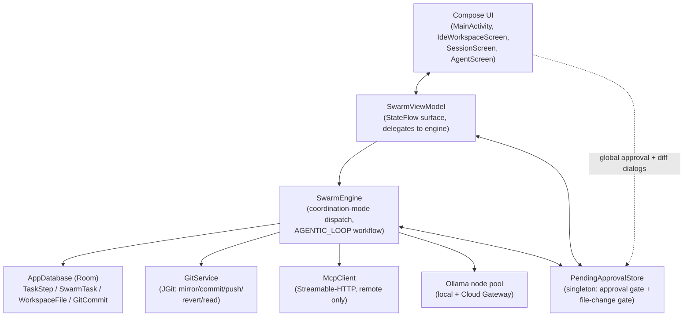

# HLD — Agentic Coding Harness

Companion to `PRD.md`. Covers system-level architecture: components,
responsibilities, and how they interact. For field-level detail (data
model, function signatures, state machines), see `LLD.md`.

## System context

The harness lives entirely inside the existing `SwarmEngine` /
`SwarmViewModel` layering — no new services, no new process boundary. One
new singleton (`PendingApprovalStore`) was added because `SwarmEngine` is a
plain class with no reference back into ViewModel-owned state (see
`agent-os/standards/state/singleton-store-for-cross-cutting-state.md`).



## Component responsibilities

| Component | Responsibility | New/changed this feature |
|---|---|---|
| `SwarmEngine.runAgenticLoopWorkflow` | Plan → act → verify loop; role routing; retry policy | Rewritten |
| `SwarmEngine.parseAndExecuteAgenticActions` | Parses `git`/`MCP_CALL:`/`WRITE_FILE:` directives out of freeform agent output | Extended (return type, `WRITE_FILE:`) |
| `SwarmEngine.executeAgenticGitCommand` / `executeAgenticMcpCall` | Executes one directive; now gates risky branches on approval | Extended |
| `SwarmEngine.executeAgenticFileWrite` | Dedicated round-trip content generation + file-diff gate | New |
| `SwarmEngine.autoCheckpoint` | Engine-driven git commit after a clean verify | New |
| `PendingApprovalStore` | Cross-cutting singleton bridging `SwarmEngine` (no ViewModel access) to `SwarmViewModel`/UI for both gates | New |
| `GitService.revertToCommit` / `readWorkDirFiles` | Hard-reset + reverse file-sync for rollback | New |
| `DiffUtils` (`ui/`) | Line-level LCS diff + render composable | New |
| `SwarmViewModel` (approval delegation) | Re-exposes `PendingApprovalStore` state; owns `revertToCheckpoint` | Extended |
| `MainActivity` (global dialogs) | Approval + file-diff dialogs, hoisted above the tab switch | Extended |
| `IdeWorkspaceScreen` (`GithubIntegrationSection`) | Per-commit revert button + confirmation | Extended |

Everything else in the diagram (`AppDatabase`, `McpClient`, node pool,
existing Compose screens) is unchanged infrastructure the harness reuses —
see the relevant `agent-os/standards/` docs for their existing contracts.

## Core flow: one checklist item, happy path

```mermaid
sequenceDiagram
    participant Loop as runAgenticLoopWorkflow
    participant Actor as Role-matched agent
    participant QA as QA-role agent
    participant Parser as parseAndExecuteAgenticActions
    participant Approval as PendingApprovalStore
    participant Git as GitService

    Loop->>Actor: act prompt (preferCloud)
    Actor-->>Loop: freeform output (may contain directives)
    Loop->>Parser: parse act output
    alt directive is risky (git push / destructive MCP)
        Parser->>Approval: requestApproval() — suspends
        Note over Approval: UI shows global dialog
        Approval-->>Parser: approved / rejected
    end
    Parser-->>Loop: ActionOutcome
    Loop->>QA: verify prompt (preferCloud)
    QA-->>Loop: verify output (may invoke MCP_CALL)
    Loop->>Parser: parse verify output
    Parser-->>Loop: ActionOutcome (mcpCallAttempted/Succeeded/resultText)
    alt looks failed and retries remain
        Loop->>Loop: bump retries, re-pick same todo
    else clean or retries exhausted
        Loop->>Git: autoCheckpoint (if clean)
        Loop->>Loop: mark todo done (+ [UNRESOLVED] if exhausted)
    end
```

## Core flow: file write

```mermaid
sequenceDiagram
    participant Actor as Acting agent
    participant Engine as SwarmEngine
    participant Approval as PendingApprovalStore
    participant UI as MainActivity dialog
    participant DB as WorkspaceFileDao

    Actor-->>Engine: "WRITE_FILE: path/to/file.kt"
    Engine->>Engine: dedicated LLM round-trip for full file content
    Engine->>Approval: requestFileChangeReview(change) — suspends
    Approval-->>UI: pendingFileChange emits
    UI->>UI: render DiffView(original, proposed)
    UI-->>Approval: acceptFileChange() / rejectFileChange()
    Approval-->>Engine: resumes with bool
    alt approved
        Engine->>DB: insert/update WorkspaceFile
    else rejected
        Engine->>DB: (no change) — write FILE_CHANGE_REJECTED step
    end
```

## Key architectural decisions

1. **Deepen `AGENTIC_LOOP`, don't add a parallel system.** All new
   behavior lives inside the existing coordination-mode dispatch in
   `SwarmEngine.executeTask`; the other four modes are untouched. This was
   an explicit scoping decision (see `agent-os/backlog.md` framing) to
   avoid a second orchestration engine.
2. **Singleton store, not constructor callbacks, for the approval gate.**
   Forced by `SwarmEngine` being a plain class with no ViewModel
   reference — see `agent-os/standards/state/singleton-store-for-cross-cutting-state.md`.
   Two independent gates (risky-action, file-diff) in one object rather
   than one unified sealed-class gate, since their payloads differ
   meaningfully.
3. **Dedicated LLM round-trip for file content, not an embedded block.**
   A `WRITE_FILE: <path>` directive is a *marker*; the actual content
   comes from a second, focused LLM call whose entire response is the raw
   file. Chosen over parsing a fenced block out of the act step's
   freeform response for reliability — a dedicated call can't be broken
   by the model wrapping content in commentary or a slightly-wrong fence
   syntax. Costs one extra LLM call per file.
4. **Engine-driven checkpointing, not LLM-discretionary.** Auto-commit
   after a clean verify, not reliant on the agent remembering to emit
   `git commit`. The LLM-discretionary commit path (`executeAgenticGitCommand`'s
   `commit` branch) still exists for agent-initiated commits; both stamp
   `GitCommit.taskId`.
5. **Verification is a text heuristic, not a protocol.** No MCP tool in
   this app declares a structured pass/fail result, so `looksFailed`
   pattern-matches `fail`/`error`/`exception` in the tool's own result
   text — same class of heuristic as the pre-existing sandbox self-healing
   check. This is a known, accepted limitation (see PRD risks).
6. **`SecurePrefsInterface` threaded into `SwarmEngine`.** Discovered
   mid-build: `SwarmEngine` was calling the real `SecurePrefs` singleton
   directly, causing intermittent Keystore crashes the first time a test
   exercised the git-push/MCP-call path. Fixed to match the existing
   interface-seam pattern — see `agent-os/standards/data/interface-seam.md`.

## Non-functional considerations

- **Testability.** All new engine logic is covered without Robolectric's
  UI layer (`SwarmEngine*Test.kt`, plain-JVM-adjacent via Robolectric for
  Room-free fakes) — see `agent-os/standards/testing/`. `PendingApprovalStore`
  is a process-wide singleton in tests too; every new test resets it in
  `@Before`/`@After`.
- **Cost.** `preferCloud` routing has no spend cap — flagged as an open
  risk in the PRD, Tier 1 backlog.
- **Reliability under this device's Robolectric constraints.** No new
  dependency on SQLite-native or Keystore-native code paths beyond what
  already existed (`SecurePrefsInterface` fix reduced reliance on real
  Keystore crypto in tests, it didn't add any).
