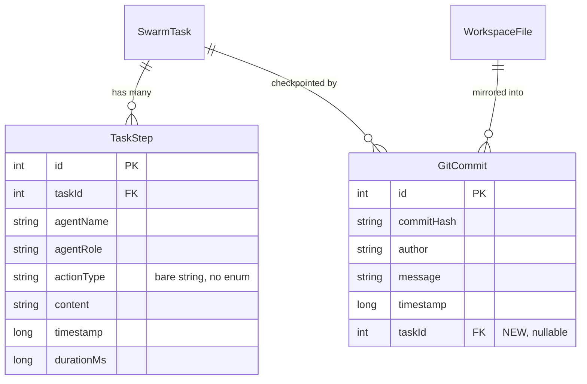
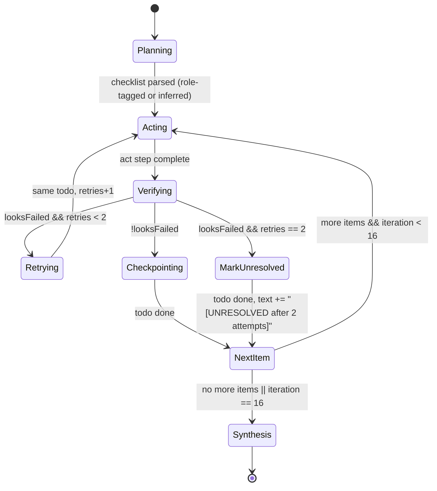

# LLD — Agentic Coding Harness

Companion to `HLD.md`. Field-level reference: data model, state machines,
function signatures, test coverage map. Code is the source of truth — this
document is a navigational aid, not a spec to re-derive from; if it drifts
from `SwarmEngine.kt`, trust the code and update this file.

## Data model changes



`AppDatabase` version `12 → 13`, no `Migration` class needed
(`fallbackToDestructiveMigration(true)` already configured).

### New `TaskStep.actionType` values

| Value | Emitted by | Meaning |
|---|---|---|
| `VERIFYING` | verify phase | QA agent's reasoning + result for one checklist item |
| `EXEC_RESULT` / `EXEC_RESULT_FAILED` | verify phase's `MCP_CALL:` | real tool-call outcome during verification (success/failure action-type override of the shared MCP-call step) |
| `CHECKPOINT_COMMIT` | `autoCheckpoint` | engine-driven commit after a clean verify |
| `FILE_CHANGE_APPLIED` / `FILE_CHANGE_REJECTED` | `executeAgenticFileWrite` | outcome of a `WRITE_FILE:` diff review |
| `ACTION_DECLINED` | `executeAgenticGitCommand` (push) / `executeAgenticMcpCall` | shared value for a rejected approval, either kind |

### New types (`PendingApprovalStore.kt`, in-memory only — not Room entities)

```kotlin
enum class ApprovalRiskCategory { GIT_PUSH, MCP_DESTRUCTIVE_CALL }

data class PendingApproval(
    val id: Long, val taskId: Int, val agentName: String,
    val riskCategory: ApprovalRiskCategory, val description: String, val detail: String = ""
)

data class PendingFileChange(
    val taskId: Int, val agentName: String, val filePath: String,
    val originalContent: String, val proposedContent: String, val isNewFile: Boolean
)
```

## `runAgenticLoopWorkflow` state machine



`Todo` shape: `data class Todo(val text: String, val done: Boolean, val role: String? = null, val retries: Int = 0)`.
`maxIterations = 16`, `maxRetriesPerTodo = 2` — both local `val`s in
`runAgenticLoopWorkflow`, not configurable today.

### Role routing

- `planningAgent` = first agent with `role.equals("Architect", ignoreCase=true)`, else `agents.first()`.
- Each todo's `role` comes from a `- [Role] text` tag (regex `^\[(\w+)]\s*(.*)$`)
  or, when untagged, `inferRoleFromText()` keyword inference (`test|verify|qa|bug`
  → QA; `design|architecture|schema|contract` → Architect; else Programmer).
- `pickAgentForRole(agents, role, fallback)`: exact role match, then
  substring match, then `fallback` (the planning agent).
- `pickQaAgent(agents, fallback)`: role containing `qa`/`bug`, then name
  containing `bug hunter`, then `fallback`. **Always** used for the verify
  phase regardless of the acting agent's role — this is the mechanism
  behind PRD FR2.

### Failure detection (`looksFailed`)

```kotlin
val looksFailed = verifyOutcome.mcpCallAttempted && (
    !verifyOutcome.mcpCallSucceeded ||
    verifyOutcome.mcpResultText?.lowercase()?.let { t ->
        listOf("fail", "error", "exception").any(t::contains)
    } == true
)
```
Only evaluated when the QA agent actually emitted `MCP_CALL:` — a QA agent
that reasons "no tooling available" produces `mcpCallAttempted = false` and
the todo is marked done normally (graceful degradation, not a failure).

## `parseAndExecuteAgenticActions` — shared directive parser

Used by all 5 coordination modes; the harness extended it, didn't fork it.

```kotlin
private suspend fun parseAndExecuteAgenticActions(
    taskId: Int, agentName: String, output: String,
    mcpSuccessActionType: String = "MCP_TOOL_CALL",
    mcpFailureActionType: String = "MCP_CALL_FAILED"
): ActionOutcome
```

Per-line scan of `output`:
| Prefix | Handler |
|---|---|
| `git ` / `$ git ` | `executeAgenticGitCommand` |
| `MCP_CALL:` | `executeAgenticMcpCall` → contributes to returned `ActionOutcome` |
| `WRITE_FILE:` | `executeAgenticFileWrite` (fire-and-forget w.r.t. the returned outcome) |

`ActionOutcome(mcpCallAttempted: Boolean, mcpCallSucceeded: Boolean, mcpResultText: String?)`
— only the *last* `MCP_CALL:` line in a given output wins if there are
multiple (accepted simplification, matches the pre-existing single-outcome
implicit behavior).

## Approval gate mechanics

`PendingApprovalStore` generalizes the pre-existing self-healing
`CompletableDeferred` pattern (`SwarmViewModel.kt`, self-healing block) into
a package-level singleton so `SwarmEngine` can reach it directly:

```kotlin
suspend fun requestApproval(taskId, agentName, riskCategory, description, detail = ""): Boolean {
    val deferred = CompletableDeferred<Boolean>()
    approvalDeferred = deferred
    _pendingApproval.value = PendingApproval(...)
    val result = deferred.await()   // <- suspends the engine coroutine here
    _pendingApproval.value = null
    approvalDeferred = null
    return result
}
fun approve() = approvalDeferred?.complete(true)
fun reject() = approvalDeferred?.complete(false)
```

Same shape for `requestFileChangeReview`/`acceptFileChange`/`rejectFileChange`,
independent state. `reset()` exists only for test isolation (process-wide
singleton — see Test coverage map below).

### Risk classification (`isRiskyMcpCall`)

1. If `McpToolEntity.annotationsJson` parses and has `destructiveHint: true` → risky.
2. If it has `readOnlyHint: true` → not risky.
3. Else, keyword match on `"${skill.name} ${skill.description} ${toolEntity?.name}"`.lowercase()
   against `delete|remove|drop|push|deploy|destroy|force|publish|merge`.

Git: only `command.startsWith("git push")` is risky; `commit`/`branch` stay
immediate (local, reversible).

### Wiring points

- `executeAgenticGitCommand`, inside the `git push` branch, **after** the
  remote-URL/token-configured check, **before** `gitService.push(...)`.
- `executeAgenticMcpCall`, **after** required-arg validation, **before**
  `mcpClient.initialize(...)`.

## `executeAgenticFileWrite`

```kotlin
private suspend fun executeAgenticFileWrite(taskId: Int, agentName: String, filePath: String, context: String) {
    val existing = db.workspaceFileDao().getFileByPath(filePath)
    val proposedContent = generateFreeform(contentPrompt, systemPrompt, preferCloud = true) // dedicated round-trip
    val approved = PendingApprovalStore.requestFileChangeReview(PendingFileChange(...))
    // approved -> insert/update WorkspaceFile + FILE_CHANGE_APPLIED step
    // !approved -> FILE_CHANGE_REJECTED step, no DB write
}
```
`context` passed in is the **entire act-step output** (not just the
`WRITE_FILE:` line) — the content-generation prompt gets the full
surrounding reasoning as context for what to write.

## Checkpoint + rollback

```kotlin
private suspend fun autoCheckpoint(taskId: Int, agentName: String, todoText: String) {
    val files = db.workspaceFileDao().getAllFiles().first()
    gitService.mirrorFiles(files)
    val (result, status) = gitService.commitAll("Agentic Loop", "agentic-loop@swarm.local", "Checkpoint: $todoText")
    // GitOpResult.Failure("No changes to commit.") is expected/benign, not surfaced as an error step
}
```

Rollback (`SwarmViewModel.revertToCheckpoint`, user-initiated only, **not**
routed through `PendingApprovalStore` — that gate is specifically for
*agent*-initiated risky actions):

```kotlin
fun revertToCheckpoint(commit: GitCommit) {
    val status = gitService.revertToCommit(commit.commitHash)  // git reset --hard
    if (status is Success) {
        val diskFiles = gitService.readWorkDirFiles()           // walk workDir, exclude .git
        // delete WorkspaceFile rows not on disk, upsert the rest to match disk content
    }
}
```
`GitService.revertToCommit`: `git.reset().setMode(ResetType.HARD).setRef(commitHash).call()`.
`GitService.readWorkDirFiles`: recursive walk of `workDir` excluding `.git`,
mirrors `mirrorFiles()`'s relative-path convention in reverse.

## Model routing (`preferCloud`)

```kotlin
private fun OllamaNode.isCloudGatewayNode(): Boolean =
    name.equals("Ollama Cloud Gateway", ignoreCase = true) || url.contains("ollama.com", ignoreCase = true)
```
In `generateFromFallbackPool`: when `preferCloud = true`, filter the online
pool to cloud-gateway nodes first, `.ifEmpty { allOnlineNodes }` — never a
hard failure just because the cloud gateway is offline. Threaded through
`generateOutputForAgentStreaming` and `generateFreeform` as a trailing
default-`false` parameter (source-compatible with every pre-existing call
site). The agentic loop passes `preferCloud = true` for plan, act, verify,
final synthesis, and file-content generation — every LLM call the loop
makes prefers cloud. (This blanket scope is itself Tier-1-adjacent — see
PRD FR13, cost risk.)

## Diff algorithm (`DiffUtils.kt`)

Line-level LCS (`computeSimpleLineDiff`), O(n·m) DP table, ~40 lines, no
dependency. Guards the `"".split("\n") == [""]` Kotlin footgun explicitly
(empty original/proposed must diff as zero lines, not one blank line —
this was a real bug caught by `DiffUtilsTest` during development).

## Test coverage map

| File | Covers |
|---|---|
| `SwarmEngineCloudRoutingTest` | `preferCloud` node selection + fallback when cloud offline |
| `SwarmEngineRoleAssignmentTest` | Role-tagged + keyword-inferred routing; verify always QA |
| `SwarmEngineVerifyLoopTest` | Retry-then-`[UNRESOLVED]`; checkpoint only on clean verify |
| `SwarmEngineApprovalGateTest` | git-push and MCP approve/reject; non-risky calls never pause |
| `SwarmEngineFileWriteTest` | `WRITE_FILE:` accept/reject, new-file vs. existing-file diff |
| `DiffUtilsTest` | LCS diff correctness incl. empty-string edge cases |
| `GitServiceTest` (additions) | `revertToCommit` / `readWorkDirFiles` round-trip against a real temp JGit repo |
| `SwarmEngineAgenticLoopTest` (pre-existing, updated) | Step-count and iteration-cap assertions updated for the verify phase + `maxIterations` 8→16 |

All new `SwarmEngine*Test` files call `PendingApprovalStore.reset()` in
`@Before`/`@After` — it's a process-wide singleton, and a leaked pending
deferred from one test would hang or corrupt the next.

## Known limitation: `SwarmEngineStreamingTest` flake

Pre-existing, unrelated to this feature — real-wall-clock timing in
`StreamThrottle` (uses `System.currentTimeMillis()`, not virtual test time)
under system load. Reproduced identically before and after this feature's
changes. Not fixed as part of this work; tracked as a known flake, not a
backlog item (out of scope — belongs to whichever future work touches
`streamIntoStep`/`StreamThrottle`).
